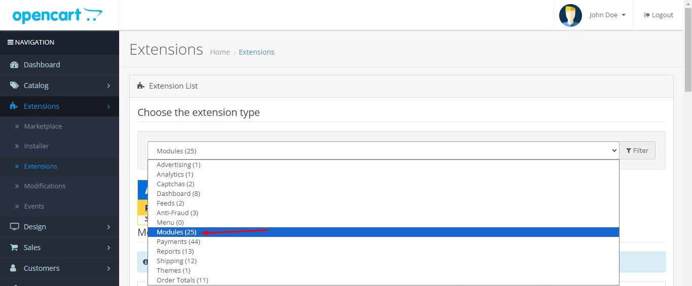
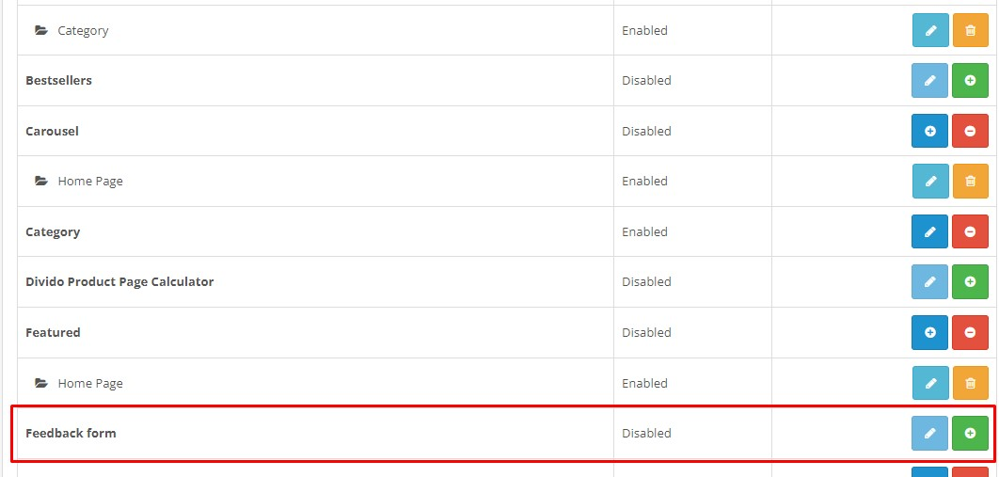
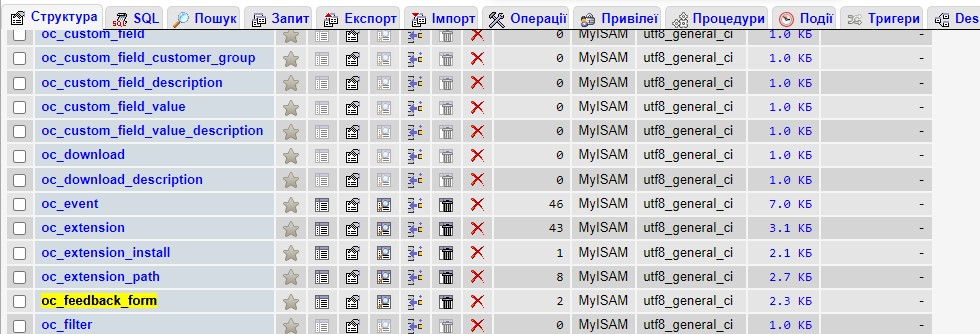
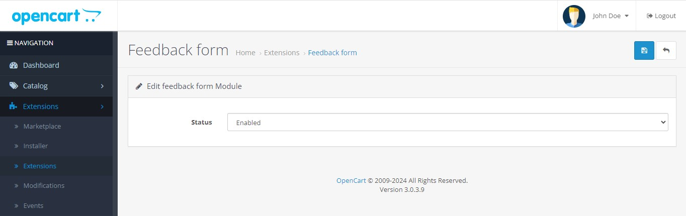
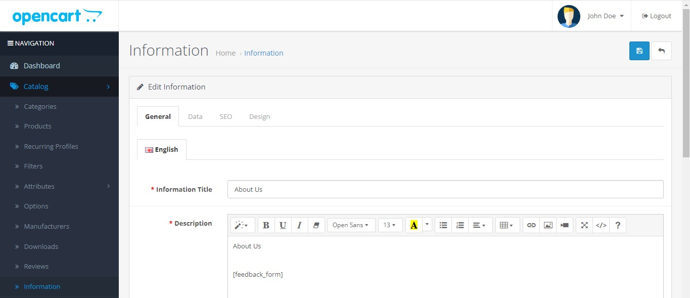
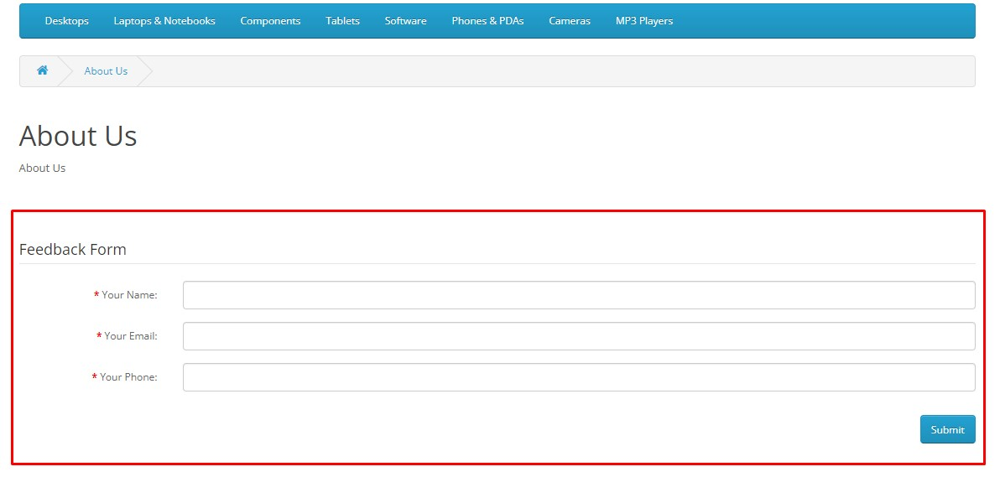

# Quick start

1) In the admin panel on the **Extension Installer** page, upload the archive `feedback_form.ocmod.zip`

2) In the admin panel on the **Extensions** page, select the `Modules` filter.

3) Find the **Feedback form** module in the list and install it.

4) The *oc_feedback_form* table will appear in the database into which data from the form will be saved.

5) Go to the **Feedback form** settings editing page and change the status to enabled.

6) The module is ready for use. You can go to edit any **Information** page and insert the `[feedback_form]` shortcode where necessary.

7) After saving, the form will appear on the page.

